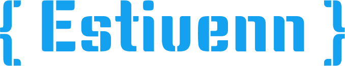

## Hi there 👋 I'm 

 
 

I am a web developer with a focus on creating practical and efficient solutions for both frontend and backend development. I am constantly seeking new opportunities to learn and grow in the tech world. My experience with various projects has refined my coding skills and allowed me to implement the latest technologies to enhance efficiency and effectiveness. I am passionate about leveraging new tools and techniques to deliver high-quality, cutting-edge solutions.

 
- 🌱 I’m currently learning <strong>Docker</strong>, <strong>Kotlin</strong>
 
- 👯 I’m looking to collaborate on <strong>interesting web development projects</strong> where I can learn, grow, and contribute with my skills.
 
- 📧 How to reach me estivenngarcia@gmail.com
 
- 🐶 Team Dogs <3

  

## 👨🏻‍💻 Technologies I Use

:art: <strong>Backend:</strong>   

 

🖥️ <strong>Frontend:</strong>   

  

<h3>👴 <i> "In the world of programming, code is not just a tool for creation but a reflection of our ability to solve problems and build the future." </i> 🍷  </h3> 

    
<h1>Thank You! 🤵🗿</h1>  

<!--
**EstivennGarcia19/Estivenngarcia19** is a ✨ _special_ ✨ repository because its `README.md` (this file) appears on your GitHub profile.

Here are some ideas to get you started:

- 🔭 I’m currently working on ...
- 🌱 I’m currently learning React, Ja  ...
- 👯 I’m looking to collaborate on ...
- 🤔 I’m looking for help with ...
- 💬 Ask me about ...
- 📫 How to reach me: ...
- 😄 Pronouns: ...
- ⚡ Fun fact: ...
-->
